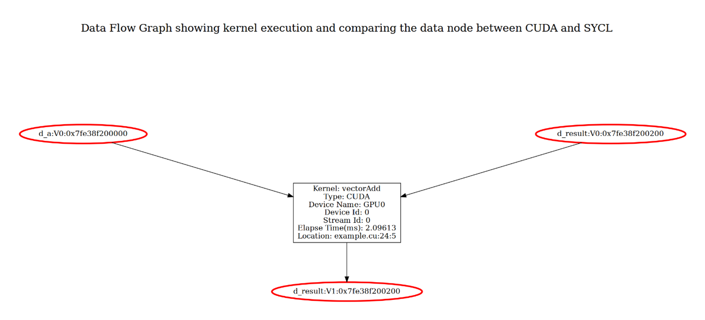

.. _debug_codepin:

Debug Migrated Code: Runtime Behavior
=====================================

.. note:: The CodePin feature is experimental and will be finalized in a future release.

In some cases, the migrated SYCL\* program may have runtime behavior that differs
from the original CUDA\* program. Reasons for this inconsistency may include:

* Difference in arithmetic precision between hardware
* Semantic difference between the CUDA and SYCL APIs
* Errors introduced during the automatic migration

CodePin is feature of |tool_name| that helps reduce the effort of debugging such
inconsistencies in runtime behavior. When CodePin is enabled, |tool_name| will
migrate the CUDA program to SYCL, but will also generate an instrumented version
of the CUDA program.

The instrumented code will dump the data of related variables, before and after
selected API or kernel calls, into a report. Compare the reports generated from
the CUDA and SYCL programs to help identify the source of divergent runtime behavior.

Enable CodePin
--------------

Enable CodePin with the ``–enable-codepin`` option. The instrumented program will be put
in the folder ``dpct_output_codepin_cuda`` and ``dpct_output_codepin_sycl``.

Example
-------

The following example CUDA code has an issue in the cudaMemcpy() before the
vectorAdd kernel call: the size to be copied is hard coded as ``vectorSize * 12``
instead of ``vectorSize * sizeof(int3)``, which causes incorrect behavior of the
migrated SYCL program. This is because ``int3`` will be migrated to ``sycl::int3``
and the size of ``sycl::int3`` is 16 bytes, not 12 bytes.

.. code-block:: c++

    //example.cu
    #include <iostream>
    __global__ void vectorAdd(int3 *a, int3 *result) {
        int tid = blockIdx.x * blockDim.x + threadIdx.x;
        result[tid].x = a[tid].x + 1;
        result[tid].y = a[tid].y + 1;
        result[tid].z = a[tid].z + 1;
    }

    int main() {
        const int vectorSize = 4;
        int3 h_a[vectorSize], h_result[vectorSize];
        int3 *d_a, *d_result;
        for (int i = 0; i < vectorSize; ++i)
            h_a[i] = make_int3(1, 2, 3);

        cudaMalloc((void **)&d_a, vectorSize * sizeof(int3));
        cudaMalloc((void **)&d_result, vectorSize * sizeof(int3));

        // Copy host vectors to device
        // !! Using 12 instead of "sizeof(int3)"
        cudaMemcpy(d_a, h_a, vectorSize * 12, cudaMemcpyHostToDevice);

        // Launch the CUDA kernel
        vectorAdd<<<1, 4>>>(d_a, d_result);

        // Copy result from device to host
        cudaMemcpy(h_result, d_result, vectorSize * sizeof(int3),
            cudaMemcpyDeviceToHost);

        // Print the result
        for (int i = 0; i < vectorSize; ++i) {
            std::cout << "Result[" << i << "]: (" << h_result[i].x << ", "
                    << h_result[i].y << ", " << h_result[i].z << ")\n";
        }
    }

    /*
    Execution Result:
    Result[0]: (2, 3, 4)
    Result[1]: (2, 3, 4)
    Result[2]: (2, 3, 4)
    Result[3]: (2, 3, 4)
    */

To debug the issue, the migrate the CUDA program with CodePin enabled:

.. code-block:: bash

    dpct example.cu --enable-codepin

After migration, there will be two files: ``dpct_output_codepin_sycl/example.dp.cpp`` and ``dpct_output_codepin_cuda/example.cu``.

.. code-block:: bash

    workspace
    ├── example.cu
    ├── dpct_output_codepin_sycl
    │   ├── example.dp.cpp
    │   ├── generated_schema.hpp
    │   └── MainSourceFiles.yaml
    ├── dpct_output_codepin_cuda
    │   ├── example.cu
    │   └── generated_schema.hpp

``dpct_output_codepin_sycl/example.dp.cpp`` is the migrated and instrumented SYCL program:

.. code-block:: c++

    //dpct_output_codepin_sycl/example.dp.cpp
    #include <dpct/dpct.hpp>
    #include <sycl/sycl.hpp>

    #include "generated_schema.hpp"
    #include <dpct/codepin/codepin.hpp>
    #include <iostream>

    void vectorAdd(sycl::int3 *a, sycl::int3 *result,
                const sycl::nd_item<3> &item_ct1) {
        int tid = item_ct1.get_group(2) * item_ct1.get_local_range(2) +
                    item_ct1.get_local_id(2);
        result[tid].x() = a[tid].x() + 1;
        result[tid].y() = a[tid].y() + 1;
        result[tid].z() = a[tid].z() + 1;
    }

    int main() {
        sycl::device dev_ct1;
        sycl::queue q_ct1(dev_ct1,
                            sycl::property_list{sycl::property::queue::in_order()});
        const int vectorSize = 4;
        sycl::int3 h_a[vectorSize], h_result[vectorSize];
        sycl::int3 *d_a, *d_result;
        for (int i = 0; i < vectorSize; ++i)
            h_a[i] = sycl::int3(1, 2, 3);

        d_a = sycl::malloc_device<sycl::int3>(vectorSize, q_ct1);
        dpct::experimental::get_ptr_size_map()[*((void **)&d_a)] =
            vectorSize * sizeof(sycl::int3);

        d_result = sycl::malloc_device<sycl::int3>(vectorSize, q_ct1);
        dpct::experimental::get_ptr_size_map()[*((void **)&d_result)] =
            vectorSize * sizeof(sycl::int3);

        // Copy host vectors to device
        q_ct1.memcpy(d_a, h_a, vectorSize * 12);

        // Launch the CUDA kernel
        dpctexp::codepin::gen_prolog_API_CP(
            "vectorAdd:example.cu:24:9",
            &q_ct1, "d_a", d_a, "d_result", d_result);
        q_ct1.parallel_for(
            sycl::nd_range<3>(sycl::range<3>(1, 1, 4), sycl::range<3>(1, 1, 4)),
            [=](sycl::nd_item<3> item_ct1) { vectorAdd(d_a, d_result, item_ct1); });

        // Copy result from device to host
        dpctexp::codepin::gen_epilog_API_CP(
            "vectorAdd:example.cu:24:9",
            &q_ct1, "d_a", d_a, "d_result", d_result);

        q_ct1.memcpy(h_result, d_result, vectorSize * sizeof(sycl::int3)).wait();

        // Print the result
        for (int i = 0; i < vectorSize; ++i) {
            std::cout << "Result[" << i << "]: (" << h_result[i].x() << ", "
                    << h_result[i].y() << ", " << h_result[i].z() << ")\n";
        }
    }

    /*
    Execution Result:
    Result[0]: (2, 3, 4)
    Result[1]: (2, 3, 4)
    Result[2]: (2, 3, 4)
    Result[3]: (1, 1, 1) <--- incorrect result
    */

``dpct_output_codepin_cuda/example.cu`` is the instrumented CUDA program:

.. code-block:: c++

    //dpct_output_codepin_cuda/example.cu
    #include "generated_schema.hpp"
    #include <dpct/codepin/codepin.hpp>
    #include <iostream>

    __global__ void vectorAdd(int3 *a, int3 *result) {
        int tid = blockIdx.x * blockDim.x + threadIdx.x;
        result[tid].x = a[tid].x + 1;
        result[tid].y = a[tid].y + 1;
        result[tid].z = a[tid].z + 1;
    }

    int main() {
        const int vectorSize = 4;
        int3 h_a[vectorSize], h_result[vectorSize];
        int3 *d_a, *d_result;
        for (int i = 0; i < vectorSize; ++i)
            h_a[i] = make_int3(1, 2, 3);

        cudaMalloc((void **)&d_a, vectorSize * sizeof(int3));
        dpct::experimental::get_ptr_size_map()[*((void **)&d_a)] =
            vectorSize * sizeof(int3);
        cudaMalloc((void **)&d_result, vectorSize * sizeof(int3));
        dpct::experimental::get_ptr_size_map()[*((void **)&d_result)] =
            vectorSize * sizeof(int3);

        // Copy host vectors to device
        cudaMemcpy(d_a, h_a, vectorSize * 12, cudaMemcpyHostToDevice);

        // Launch the CUDA kernel
        dpctexp::codepin::gen_prolog_API_CP(
            "vectorAdd:example.cu:24:9", 0,
            "d_a", d_a, "d_result", d_result);
        vectorAdd<<<1, 4>>>(d_a, d_result);

        // Copy result from device to host
        dpctexp::codepin::gen_epilog_API_CP(
            "vectorAdd:example.cu:24:9", 0,
            "d_a", d_a, "d_result", d_result);
        cudaMemcpy(h_result, d_result, vectorSize * sizeof(int3),
                    cudaMemcpyDeviceToHost);

        // Print the result
        for (int i = 0; i < vectorSize; ++i) {
            std::cout << "Result[" << i << "]: (" << h_result[i].x << ", "
                    << h_result[i].y << ", " << h_result[i].z << ")\n";
        }
    }

    /*
    Execution Result:
    Result[0]: (2, 3, 4)
    Result[1]: (2, 3, 4)
    Result[2]: (2, 3, 4)
    Result[3]: (2, 3, 4)
    */

After building ``dpct_output_codepin_sycl/example.dp.cpp`` and ``dpct_output_codepin_cuda/example.cu`` and executing the binaries built out
the following execution log files will be generated.

.. list-table::
   :widths: 50 50
   :header-rows: 1

   * - Report for the instrumented CUDA program
     - Report for the instrumented migrated SYCL program
   * - .. code-block::
          :linenos:

          [
              {
                  "ID": "example.cu:26:3:prolog",
                  "Device Name": "GPU",
                  "Device ID": "0",
                  "Stream Address": "0xe4bb30",
                  "Free Device Memory": "16374562816",
                  "Total Device Memory": "16882663424",
                  "Elapse Time(ms)": "0",
                  "CheckPoint": {
                      "d_a": {
                          "Type": "Pointer",
                          "Data": [
                              {
                                  "Type": "int3",
                                  "Data": [
                                      {
                                          "x": {
                                              "Type": "int",
                                              "Data": [
                                                  1
                                              ]
                                          }
                                      },
                                      {
                                          "y": {
                                              "Type": "int",
                                              "Data": [
                                                  2
                                              ]
                                          }
                                      },
            ...

     - .. code-block::
          :linenos:

          [
              {
                  "ID": "example.cu:26:3:prolog",
                  "Device Name": "GPU",
                  "Device ID": "0",
                  "Stream Address": "0x3fea40",
                  "Free Device Memory": "0",
                  "Total Device Memory": "31023112192",
                  "Elapse Time(ms)": "0",
                  "CheckPoint": {
                      "d_a": {
                          "Type": "Pointer",
                          "Data": [
                              {
                                  "Type": "sycl::int3",
                                  "Data": [
                                      {
                                          "x": {
                                              "Type": "int",
                                              "Data": [
                                                  1
                                              ]
                                          }
                                      },
                                      {
                                          "y": {
                                              "Type": "int",
                                              "Data": [
                                                  2
                                              ]
                                          }
                                      },
              ...

The report helps identify where the runtime behavior of the CUDA and the SYCL
programs start to diverge from one another.

Analyse the CodePin Result
--------------------------

CodePin Report
~~~~~~~~~~~~~~

codepin-report.py (also can be triggered by dpct/c2s --codepin-report) is a functionality of
the compatibility tool that consumes the execution log files from both CUDA and SYCL code and performs auto analysis.
codepin-report.py can identify the inconsistent data value and report the stats data of the execution.

User can specify the comparison tolerance of floating points in the following format:

.. code-block::

    {
        "bf16_abs_tol": 9.77e-04,
        "fp16_abs_tol": 9.77e-04,
        "float_abs_tol": 1.19e-04,
        "double_abs_tol": 2.22e-04,
        "rel_tol": 1e-3
    }

The first 4 items "bf16_abs_tol", "bf16_abs_tol", "bf16_abs_tol" and "bf16_abs_tol" are the absolute tolerance range of the corresponding type.
The last item, "rel_tol", is the relative tolerance represented by a ratio value.

codepin-report.py consumes the execution log files generated from both CUDA and SYCL code with the following command line.
``codepin-report.py [-h] --instrumented-cuda-log <file path> --instrumented-sycl-log <file path> [--floating-point-comparison-epsilon <file path>]``

Following is an example of the analysis report.

.. code-block::

    CodePin Summary
    Total API count, 2
    Consistent API count, 0
    Most Time-consuming Kernel(CUDA), vectorAdd:example.cu:24:5:epilog, time:16.8069
    Most Time-consuming Kernel(SYCL), vectorAdd:example.cu:24:5:prolog, time:18.3240
    Peak Device Memory Used(CUDA), 445644800
    Peak Device Memory Used(SYCL), 540689534976
    CUDA Meta Data ID, SYCL Meta Data ID, Type, Detail
    vectorAdd:example.cu:24:5:epilog,vectorAdd:example.cu:24:5:epilog,Data value,The location of failed ID Errors occurred during comparison: d_a->"Data"->[3]->"Data"->[0]->"x"->"Data"->[0] and [ERROR: DATA VALUE MISMATCH] the CUDA value 1 differs from the SYCL value 26518016.; d_result->"Data"->[3]->"Data"->[0]->"x"->"Data"->[0] and [ERROR: DATA VALUE MISMATCH] the CUDA value 2 differs from the SYCL value 26518017.
    vectorAdd:example.cu:24:5:prolog,vectorAdd:example.cu:24:5:prolog,Data value,[WARNING: METADATA MISMATCH] The pair of prolog data vectorAdd:example.cu:24:5:prolog are mismatched, and the corresponding pair of epilog data matches. This mismatch may be caused by the initialized memory or argument used in the API vectorAdd.

Data Flow Graph  
~~~~~~~~~~~~~~~

codepin-report.py can generate a data   flow graph for 
kernels with option ``--generate-data-flow-graph``.  The data flow graph presents visualizations of kernel execution and compares results between CUDA and SYCL, highlighting the execution mismatch between CUDA and SYCL code.
In the data flow graph, each kernel execution and its input and output arguments are grouped into a layer, presenting a run status of the kernel execution. The value   of input and output arguments are tagged with version information in the form of “V<num>”. For example,   the initial version is tagged as V0, and once the value of the argument is updated, the version number will be increased. For a specific kernel execution, if there’s a mismatch between CUDA and SYCL results, the mismatched argument node will be colored red.

   DataFlowGraph

The above picture shows the data flow graph of the vectorAdd example, which is constructed by a title and execution layer. The execution layer presents a kernel execution and its inputs and outputs. The kernel node shows that kernel ``vectorAdd`` is executed on the stream of the device named GPU0, and also shows the kernel's execution time and source location. All input arguments (``d_a`` node and top ``d_result`` node) are tagged with V0, indicating initial values. The output argument (bottom ``d_result`` node) is tagged with V1 because ``d_result`` is both input and output arguments, and its value changes in the kernel. 

The nodes ``d_a:V0 ``,  ``d_result:V0``, and ``d_result:V1`` are colored red, indicating a value mismatch between the CUDA and SYCL runs. In this case, the result value mismatch is caused by the mismatch of the input argument values, and the mismatch between input argument values may be caused by the different behavior of memory initialization between CUDA and SYCL, as the report states.

This data flow graph target provides a clear view of the execution process, making it easy to identify discrepancies and track variable changes across executions.
